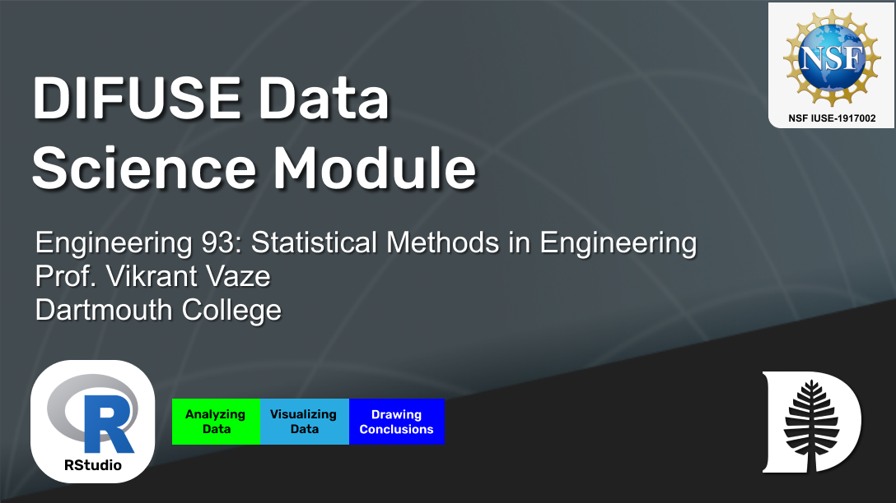

# Engineering: Statistics in R DIFUSE Module 

## Contributors: Sarah Korb('22), Alexander Robertson ('23), Vikrant Vaze (Professor of Engineering), Scott Pauls (DIFUSE PI, Professor of Mathematics), Petra Bonfert-Taylor (DIFUSE PI, Professor of Engineering), Lorie Loeb (DIFUSE PI, Professor of Computer Science), Tiffany Yu ('21, Project Manager)

This module was developed through the DIFUSE project at Dartmouth College and funded by the National Science Foundation award IUSE-1917002.

| | <a rel="license" href="http://creativecommons.org/licenses/by-sa/4.0/"> </a>This work is licensed under a <a rel="license" href="http://creativecommons.org/licenses/by-sa/4.0/">Creative Commons Attribution-ShareAlike 4.0 International License</a>. |
|---------|----------|

# Module Overview
## Module Objective 
Introduce students to basic functional R commands/procedures whilst tying in key statistical concepts. Gives novice students confidence in R and challenges experienced students.

## Student Learning Objectives
List student learning objectives. What do you want the students to have learnt from the module?
1. Understand engineering statistical concepts 
2. Learn R documentation to implement statistical analysis
3. Use R to visualize popular distrbutions and perform hypothesis tests

## Module Description
Students will complete RX’s as dictated by the syllabus. No grade will be given for the completion of an RX, but the HW (graded) notebooks will build off tasks performed in accompanying RX’s. HW NBs will be turned in on canvas as a .ipynb file. HW solution NBs will be released after deadline for HW. Code is stored in the .ipynb files themselves whil datasets are stored in the DIFUSE Github.

### Data
Datasets are numeric files saved as .txt. They will be read into the Jupyter Notebook and used for data analysis and drawing conclusions. 

### Platform
Jupyter Notebook running RStudio

## Schedule and Links
Use this page to get an idea of the timeline of the module, what components are involved, and what documents are related to each component. This is the schedule intended for module deployment by the DIFUSE team, though instructors are welcome to modify the timeline to fit their course environment.

| Date      | Name  | Assignment Description         | Assignment Files (Linked to Repository Contents) |
|-----------|--------------------------|-------------------------------|---------------------------------|
| Week 1 | RX_0: Fuel Efficiency | After introducing R and some basic commands, this exercise looks at data on gas mileage of cars as reported in www.fueleconomy.gov.| [RX0_Ex](completed_module/components/RX0/) |
| Week 2 | RX_1: Importing Data and Histograms | In this exercise, we will explore the **distributions of depth and velocity in streams**, as well as their **joint distribution**. Along the way, we will cover various R functions for working with both **empirical (i.e. data-based) and theoretical distributions**. | [RX1_Ex & HW](completed_module/public/components/RX1/) |
| Week 3 | RX_2: Hypothesis Testing | The  human  body comes  in  various  shapes, sizes,  and  temperatures.  For  this  project,  two data sets are used to test various measurements of human bodies. | [RX2_Ex & HW](completed_module/public/components/RX2/)
| Week 4 | RX_3: Hypothesis Testing | In this exercise, we will explore the concepts of statistical hypothesis testing, specificity, and power using examples related to GRE scores and coaching effectiveness. | [RX3_Ex & HW](completed_module/public/components/RX3/) |
| Week 5 | RX_4: DDT in the Tennessee River| Chemical and manufacturing plants have historically discharged toxic waste materials into nearby rivers and streams. These toxicants have a detrimental effect on the plant and animal life inhabiting the river and the river's bank. With DDT measurements from captured fish, we will investigate the severity of these issues in this exercise.| [RX4_Ex & HW](completed_module/public/components/RX4/)
| Week 6 | RX_5: ANOVA in Fertilizer and Sap Production | There is some controversy over whether fertilizer application can boost sap production in maple trees. The Vermont Maple Sugar Producers sponsored a testing program to determine the benefit of fertilizer application and in this exercise, we use ANOVA to analyze the results | [RX5_Ex & HW](completed_module/public/components/RX5/) |

## Course Information
This course was developed for <a href="http://dartmouth.smartcatalogiq.com/current/orc/Departments-Programs-Undergraduate/Engineering-Sciences/ENGS-Engineering-Sciences-Undergraduate/ENGS-93">Engineering 93: Statistical Methods in Engineering</a>, at Dartmouth College which explores the application of statistical techniques and concepts to maximize the amount and quality of information resulting from experiments. The course is a culminating level course in the undergraduate Engineering Department. It has one prerequiste class: <a href="http://dartmouth.smartcatalogiq.com/current/orc/Departments-Programs-Undergraduate/Mathematics/MATH-Mathematics-Undergraduate/MATH-13">Calculus of Vector Valued Functions

---

| | <a rel="license" href="http://creativecommons.org/licenses/by-sa/4.0/"> </a>This work is licensed under a <a rel="license" href="http://creativecommons.org/licenses/by-sa/4.0/">Creative Commons Attribution-ShareAlike 4.0 International License</a>. |
|---------|----------|

For instructors and interested parties, the history of this repository (with detailed commits), can be found [here](https://github.com/difuse-dartmouth/engineering-statistics-in-R/commits/main/).
